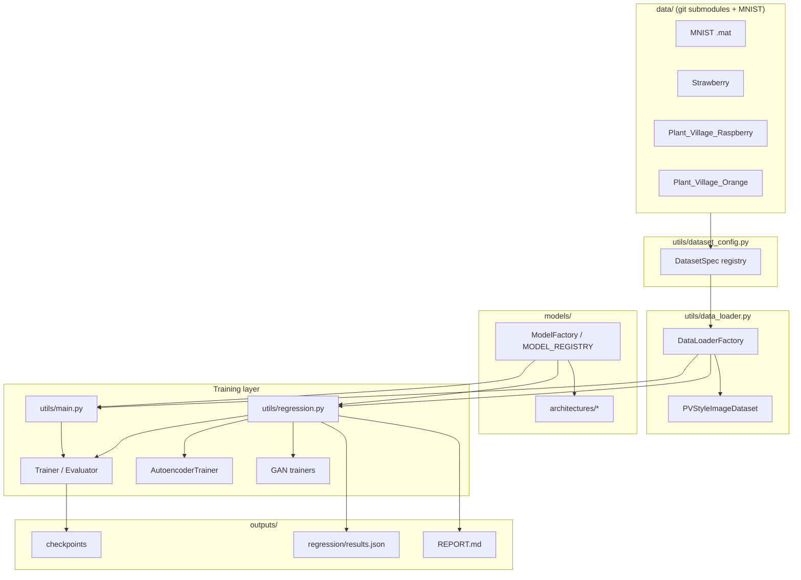

# Architecture: Agriculture Model Benchmarking Sandbox

This document describes the purpose, design, and operation of the **mnist_sandbox** project: a unified deep-learning benchmarking framework that trains and compares **50+ classification architectures** (and related generative models) so practitioners can identify the **best-performing model for a given agriculture image dataset** under comparable training conditions.

---

## Problem Statement

Agricultural computer vision tasks—crop disease detection, plant health monitoring, ripeness grading, and background rejection—require choosing a model architecture, loss function, optimizer, and hyperparameters. In practice, teams often:

- Compare only a handful of familiar models (e.g., ResNet vs. ViT) on ad hoc settings.
- Use inconsistent preprocessing, splits, or metrics across experiments.
- Lack reproducible rankings when onboarding **new crops or new standardized datasets**.

**This project addresses that gap** by providing:

1. A **single training and evaluation pipeline** that runs the same protocol across many architectures.
2. A **dataset registry** for agriculture data laid out in a common Plant-Village-style structure under `data/`.
3. An **automated regression suite** that exhaustively (or selectively) searches loss × optimizer × hyperparameter combinations and emits ranked results in `REPORT.md`.

Given any registered dataset (MNIST for development, or agriculture sets such as strawberry ripeness, raspberry health, or citrus greening), the system answers:

> *Which model family, trained with which loss/optimizer/hyperparameters, achieves the best test metric on this dataset?*

---

## Motivation

### Why agriculture needs systematic model comparison

Field and lab imagery for agriculture varies widely in resolution, class balance, and task definition (binary disease vs. multi-class ripeness). Published baselines are often tied to one architecture and one paper’s training recipe, which does not transfer cleanly when:

- Class counts change (2-class disease vs. 6-class ripeness).
- Input size is fixed at 224×224 for deployment but many legacy CNNs expect 28×28 or other layouts.
- Teams need **fast screening** (quick-test subsets) before committing GPU weeks to a full search.

### Why 50+ models in one codebase

The registry in `models/model_factory.py` encodes a **model zoo** spanning classical CNNs, lightweight mobile architectures, attention-enhanced ResNets, transformers, and sequence-style baselines. Running them through one factory and one regression driver:

- Surfaces **architecture–dataset interactions** (e.g., lightweight models on small agricultural sets vs. transformers on larger ones).
- Makes **fair comparison** possible: same splits, same early-stopping rule, same NAS search space (unless overridden).
- Supports **incremental extension**: new crops are added as git submodules and one entry in `utils/dataset_config.py`, without rewriting training loops.

### Why MNIST remains in the loop

MNIST (`data/MNISTtrain.mat`, `data/MNISTtest.mat`) is the **sanity-check benchmark**: fast iteration on 28×28 grayscale digits validates new models, losses, and parallel workers before scaling to 224×224 agriculture images.

---

## Contributions

| Contribution | Description |
| --- | --- |
| **Unified model zoo** | **50 classification models** plus 4 autoencoders and 4 GANs (**58 total**), registered in `MODEL_REGISTRY` and instantiated via `ModelFactory`. |
| **Dataset-agnostic loaders** | `DatasetSpec` + `PVStyleImageDataset` load standardized agriculture layouts (`<root>/<class>/<variant>/{images,sets}`) with per-class variant overrides (e.g. `color` vs. `without_augmentation`). |
| **NAS-style regression suite** | `utils/regression.py` and `scripts/regression.sh` run Cartesian exploration of models × losses × optimizers × sampled hyperparameters, with early stopping and optional multi-GPU workers. |
| **Reproducible reporting** | Aggregated trials written to `outputs/regression/` and summarized in `REPORT.md` (per-dataset rankings, convergence epochs, search space). |
| **Extensible agriculture data** | Git submodules under `data/` for [Strawberry](https://github.com/ai-agriculture-circuits-and-systems/Strawberry), [Plant_Village_Raspberry](https://github.com/ai-agriculture-circuits-and-systems/Plant_Village_Raspberry), and [Plant_Village_Orange](https://github.com/ai-agriculture-circuits-and-systems/Plant_Village_Orange)—all following a shared layout spec from AI Agriculture Circuits and Systems. |
| **Modular training stack** | `BaseModel`, `Trainer`, `Evaluator`, task-specific trainers (GAN, autoencoder), and `training_factory` for losses/optimizers keep single-model runs (`utils/main.py`) and batch regression aligned. |

---

## High-Level Architecture



### End-to-end flow (regression on an agriculture dataset)

1. **Select dataset** — `--dataset plant_village_orange` (or `strawberry`, `plant_village_raspberry`, `mnist`).
2. **Resolve spec** — `get_dataset_spec()` returns class names, `num_classes`, `data_root`, default image size (224 for agriculture), and optional `class_layout`.
3. **For each model** in `CLASSIFICATION_MODELS` (or a user subset via `-m`):
   - Resolve **input size** (`get_image_size`: 224 for agriculture; MNIST uses 28 or 224 for `LARGE_IMAGE_MODELS`).
   - For each **loss** × **optimizer** valid for that model category:
     - Run **NAS trials**: sample `lr`, `batch_size`, `weight_decay` from `SEARCH_SPACE`.
     - **Train** with early stopping on validation metric; record test accuracy/loss, epochs to convergence.
4. **Merge worker results**, rank trials, write **`REPORT.md`** and `outputs/regression/results.json`.

Parallel execution (`-j N`, `--parallel`) assigns one model trial per GPU (or CPU core), with OOM handling and CUDA memory cleanup between trials.

---

## Model Zoo (50+ Classification Models)

All CLI names are defined in `models/model_factory.py`. Classification models are everything in `MODEL_REGISTRY` except autoencoders and GANs.

| Category | Count (approx.) | Examples |
| --- | ---: | --- |
| Classical / CNN | 12 | `lenet`, `alexnet`, `vgg`, `resnet`, `densenet` |
| Lightweight | 10 | `mobilenet`, `mobilenetv2`, `mobilenetv3`, `ghostnet`, `mnasnet` |
| Attention ResNet | 5 | `se_resnet`, `cbam_resnet`, `eca_resnet`, `coord_resnet`, `sknet` |
| Modern CNN / hybrid | 14 | `convnext`, `repvgg`, `cspnet`, `van`, `poolformer`, `coatnet` |
| Transformers / sequence | 7 | `vit`, `deit`, `swin_tiny`, `bert`, `gpt`, `lstm`, `gru` |
| Specialized | 2+ | `capsnet`, `vim_tiny`, `inception_resnet` |

**Also registered (non-classification benchmarks):**

- **Autoencoders (4):** `simple_ae`, `conv_ae`, `vae`, `denoising_ae` — reconstruction loss on agriculture or MNIST inputs.
- **GANs (4):** `vanilla_gan`, `dcgan`, `wgan`, `cgan` — generative baselines (separate trainers).

List live models:

```bash
python -c "from models.model_factory import ModelFactory; print('\n'.join(ModelFactory.get_available_models()))"
```

---

## Agriculture Datasets (`data/`)

Datasets are **git submodules** (see `.gitmodules`) with a **standardized directory layout** so one loader can serve multiple crops.

| Registry key | Classes | Task focus | Default root |
| --- | ---: | --- | --- |
| `strawberry` | 6 | Ripeness stages (`early-turning` … `white`) | `data/Strawberry/strawberries` |
| `plant_village_raspberry` | 2 | Healthy vs. background | `data/Plant_Village_Raspberry/raspberries` |
| `plant_village_orange` | 2 | Huanglongbing (citrus greening) vs. background | `data/Plant_Village_Orange/oranges` |
| `mnist` | 10 | Digit classification (dev baseline) | `data/` (.mat files) |

**Layout (Plant-Village style):**

```
<dataset_root>/
  <class_name>/
    <variant>/          # e.g. color, without_augmentation
      images/
      sets/
        train.txt
        test.txt
```

`utils/dataset_config.py` maps class names to variants when they differ (e.g. raspberry `background_without_leaves` → `without_augmentation`). Images are loaded as RGB, resized to `default_image_size` (224), then converted to grayscale when `channels=1`.

**Aliases:** `raspberry` → `plant_village_raspberry`, `orange` → `plant_village_orange`.

Initialize submodules:

```bash
./scripts/init_submodules.sh
```

---

## Search Space and Training Protocol

Defined in `utils/regression.py`:

| Dimension | Classification | Autoencoder |
| --- | --- | --- |
| Losses | `cross_entropy`, `label_smoothing`, `focal_loss` | `mse`, `l1`, `bce` |
| Optimizers | `adam`, `sgd`, `adamw`, `rmsprop` | same |
| Hyperparameters | `lr` ∈ {1e-4, 1e-3, 1e-2}, `batch_size` ∈ {8, 16, 32}, `weight_decay` ∈ {0, 1e-4, 1e-3} | same |

- **Early stopping:** validation metric must improve by `min_delta` within `patience` epochs (defaults tuned down in `--quick-test` mode).
- **NAS trials:** random samples per (model, loss, optimizer); best trial kept per configuration.
- **Quick test:** caps epochs, patience, trials, and subsamples ~60 images per agriculture split for smoke runs.

Example — screen all classifiers on orange leaves (quick):

```bash
./scripts/regression.sh --dataset plant_village_orange -q
```

Example — compare two models on strawberry (full split lists, longer run):

```bash
./scripts/regression.sh --dataset strawberry -f -m resnet,efficientnet -j 4
```

Single-model training (same stack, manual hyperparameters):

```bash
./scripts/run.sh -m resnet --epochs 10
python -m utils.main --model densenet --epochs 5
```

---

## Repository Layout

```
mnist_sandbox/
├── data/                      # MNIST + agriculture submodules
├── models/
│   ├── architectures/         # One module per architecture family
│   ├── base_model.py
│   └── model_factory.py       # MODEL_REGISTRY (single source of truth)
├── utils/
│   ├── dataset_config.py      # DatasetSpec registry
│   ├── data_loader.py         # MNIST + PV-style loaders
│   ├── main.py                # Single-model CLI
│   ├── regression.py          # Batch NAS / regression
│   ├── trainer.py / evaluator.py
│   └── training_factory.py    # Losses and optimizers
├── scripts/
│   ├── regression.sh          # Regression wrapper
│   ├── run.sh                 # Single-model wrapper
│   └── init_submodules.sh
├── outputs/                   # Checkpoints, regression JSON
├── REPORT.md                  # Generated rankings (per run)
├── README.md                  # Usage and model tables
└── ARCHITECTURE.md            # This document
```

---

## Outputs and How to Read Results

After regression:

- **`REPORT.md`** — Human-readable tables: best configuration per model, full trial list, autoencoder/GAN sections, run configuration (dataset, classes, workers, wall time).
- **`outputs/regression/results.json`** — Machine-readable merge of all trials for downstream analysis or CI.

Use classification tables to pick a **production candidate** (highest test accuracy with acceptable training cost). Use convergence epoch columns to estimate **compute budget** for full training.

---

## Extending the System

### Add a new agriculture dataset

1. Add a git submodule under `data/<YourDataset>/` using the standardized layout.
2. Register a `DatasetSpec` in `utils/dataset_config.py` (`class_names`, `data_root`, `class_layout` if needed).
3. Extend `scripts/regression.sh` `validate_dataset` if you want shell-level checks.
4. Run `./scripts/regression.sh --dataset <your_key> -q` to validate the pipeline.

### Add a new classification model

1. Implement in `models/architectures/`, inheriting from `BaseModel`.
2. Register in `MODEL_REGISTRY` in `models/model_factory.py`.
3. Add defaults in `build_model_kwargs()` inside `utils/regression.py` if non-standard ctor args are required.
4. If the model expects 224×224 on MNIST only, add its CLI name to `LARGE_IMAGE_MODELS`.

`CLASSIFICATION_MODELS` is derived automatically from the registry.

---

## Design Principles

- **Single registry** — No duplicate model lists; regression and `main.py` both use `ModelFactory`.
- **Dataset spec drives heads** — `num_classes` from `DatasetSpec` configures the final layer for any crop.
- **Same code path for bench and deploy** — Regression uses the same `Trainer`/`Evaluator` as interactive training.
- **Fail fast on missing data** — `DatasetSpec.validate()` and `regression.sh` check split files before long GPU jobs.

---

## Summary

This sandbox turns the question *“What should we train for this agriculture dataset?”* into a **repeatable experiment**: register the crop under `data/`, run the regression suite over **50 classification models** and a structured hyperparameter search, and read off the winner from `REPORT.md`. MNIST keeps the framework honest during development; strawberry, raspberry, and orange datasets anchor the work in **real agricultural vision** tasks with shared structure and comparable metrics.

For command-level detail and per-model input sizes, see [README.md](README.md). For the latest benchmark numbers on a specific run, see [REPORT.md](REPORT.md).
